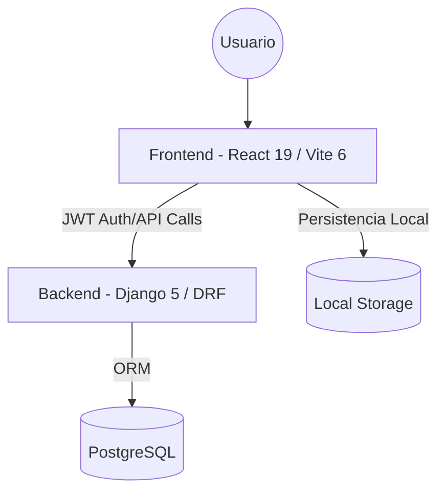

# Technical Guide / System Blueprint: WiseBet Lab

## Resumen Ejecutivo
WiseBet Lab es una plataforma avanzada de analítica y simulación de apuestas deportivas diseñada para optimizar la gestión de banca y el rendimiento de múltiples estrategias (Planes). El sistema permite consolidar datos de diferentes fuentes (Picks), simular escenarios de banca real-time y visualizar métricas críticas como ROI, Yield, Drawdown y Profit Factor.

La arquitectura se basa en un desacoplamiento total donde el frontend maneja toda la lógica de simulación pesada (para garantizar velocidad y privacidad local) y el backend actúa como almacén seguro y motor de autenticación.

---

## Arquitectura General

### Flujo de Datos
1.  **Carga**: La UI se inicializa recuperando el estado desde `LocalStorage` (caché rápida) y se sincroniza con la API de Django para datos persistentes.
2.  **Procesamiento**: El motor de cálculo en `index.tsx` procesa los picks en el cliente para ofrecer feedback instantáneo en las gráficas sin latencia de red.
3.  **Visualización**: Se utilizan Chart.js y componentes personalizados para renderizar la evolución patrimonial y comparativas.

---

## Estructura del Repositorio y Módulos Clave

### Frontend (WiseBet Tracker ROI)
- `/`: Raíz del proyecto Vite.
- `src/index.tsx`: **Módulo Crítico**. Contiene el motor de procesamiento de datos, lógica de simulación de banca y renderizado de componentes Core.
- `index.html`: Punto de entrada, manejador de estilos premium y dependencias CDN.
- `src/index.css`: Definición del sistema de diseño (Glassmorphism, Dark Mode, Variable Tokens).
- `docs/`: Documentación técnica y de integración.
- `legacy/`: Archivos heredados y backups de diseño.

### Backend (Django - Basado en Especificaciones)
- `backend/`: Proyecto principal Django.
- `apps/accounts/`: Gestión de usuarios, Login JWT y permisos.
- `apps/picks/`: Modelos de apuestas, serializadores y endpoints de historial.
- `apps/analytics/`: (Opcional) Agregaciones pesadas que la UI delega al servidor.

---

## Inventario de API (Draft)
*Nota: Basado en el stack DRF + JWT mencionado. Se requiere inspección del repo backend para confirmar.*

| Método | Endpoint | Auth | Propósito | Respuesta (Expected) |
| :--- | :--- | :--- | :--- | :--- |
| POST | `/api/token/` | No | Login / Obtener JWT | `{ access, refresh }` |
| POST | `/api/token/refresh/` | No | Renovar access token | `{ access }` |
| GET | `/api/picks/` | JWT | Obtener historial de picks | `[ { id, event, odds, ... } ]` |
| POST | `/api/picks/` | JWT | Guardar nuevo lote de picks | `{ status: "success" }` |

---

## Modelo de Datos (Core Entities)

### Pick (Apuesta)
- `id` (UUID): Identificador único.
- `date` (Date): Fecha del evento.
- `event` (String): Equipos/Ligas.
- `bet` (String): Mercado/Detalle.
- `odds` (Float): Cuota.
- `result` (Enum): WIN, LOSS, VOID, HALF_WIN, etc.
- `source` (String): Plan asociado (ELITE, PREMIUM, etc.).

### Config
- `bank_initial` (Float): Capital de inicio.
- `stake_pct` (Float): % de riesgo base.
- `use_global_bank` (Boolean): Flag de consolidación.

---

## Configuración y Ejecución Local

### Frontend
1. `npm install`
2. `npm run dev` (Puerto 5173 por defecto)
3. Variables en `.env.local`: `VITE_API_BASE_URL`

### Backend
1. Crear virtualenv: `python -m venv venv`
2. `pip install -r requirements.txt`
3. Configurar `.env` con credenciales de PostgreSQL.
4. `python manage.py migrate`
5. `python manage.py runserver`

---

## Checklist de Handoff para el Desarrollador
- [ ] Clonar repo y configurar variables de entorno (`.env`).
- [ ] Entender el motor de procesamiento en `index.tsx` (en `src/`).
- [ ] Verificar acceso a Swagger en `/api/schema/swagger-ui/`.
- [ ] Ejecutar migraciones iniciales de DB.
- [ ] Testear flujo de login con el código de administración (`admin123` en prototipo).
